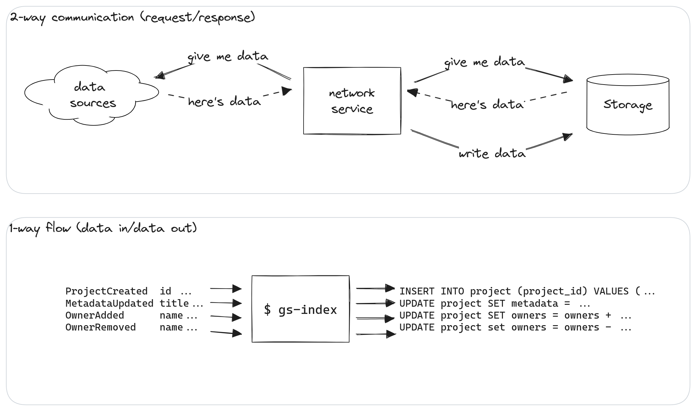

<style scoped>
.columns {
    grid-template-columns: 1fr 3fr;
}
.columns > div:nth-child(1) > p {
  text-align: right;
}
.columns > div:nth-child(2) > p {
  text-align: left;
}
.links > p {
  font-size: 0.75em;
  text-align: right;
}
</style>

<div class="columns">
<div>

**pluralistic-rs**
**gs-index**
**gs-log**

</div>

<div>

😱 _screaming fast pluralistic calculator in Rust_
🛠️ _composable command-line indexer in Rust_
🔄 _resumable chain logger in TypeScript_

</div>

</div>

<div class="links">

https://github.com/vacekj/pluralistic-rs
https://github.com/bard/gs-index
https://github.com/bard/gs-log

</div>

---

# pluralistic-rs · slide 1

---

# pluralistic-rs · slide 2

---

# Why index anyway?

<style scoped>
h4 {
  text-align: center;
}
</style>

<div class="columns">
<div>
<h4>What the blockchain offers:</h4>

```
ProjectCreated  id:    0x123
MetadataUpdated title: My Project
OwnerAdded      name:  Alice
ProjectCreated  id:    0x456
OwnerRemoved    name:  Bob
...             ...    ...
```

</div>

<div>
<h4>What apps want:</h4>

_"What projects are out there?"_
_"Who owns project 0x123?"_
_"How is project 0x456 called?"_

</div>
</div>

Indexing turns blockchain logs into a format that allows answering the questions that our apps are interested in.

---



---

# gs-index · use cases

Index local or remote historical data:

```sh
$ cat 'event_log.ndjson' | gs-index | psql mydb
```

```sh
$ curl 'https://some.s3.bucket/event_log.ndjson' | gs-index | psql mydb
```

---

# gs-index · use cases

Index only specific events:

```sh
$ cat 'event_log.ndjson' |
  jq 'select(.name=="ProjectCreated" or .name=="RoundCreated")' |
  gs-index |
  psql mydb
```

---

# gs-index · use cases

Log on one machine, index on another:

<div style="text-align: center; padding-top: 1rem;">
  <video src="./assets/gs-log-index-demo.webm" controls width="90%"></video>
</div>

# gs-index · use cases

<style scoped>
aside {
  text-align: right; 
  font-size: smaller
}
</style>

Continuously index live events while keeping a log:

```sh
$ gs-log --chains '58008:origin..ongoing' |
  tee 'event_log.ndjson' |
  gs-index |
  psql mydb
```

<aside>

([gs-log](https://github.com/bard/gitcoin-hackathon-gs-log) uses [chainsauce](https://github.com/gitcoinco/chainsauce), s/o to [Mo](https://github.com/boudra)!)

</aside>

---

# gs-index · use cases

Resume indexing after an interruption:

```sh
$ cat 'event_log.ndjson' |
  gs-log --resume |
  tee --append 'event_log.ndjson' |
  gs-index |
  psql mydb
```

---

# gs-index · use cases

Publish events from a server, listen on a client:

```sh
$ gs-log >'event_log.ndjson' &
$ websocket-tail -p 8080 'event_log.ndjson'
```

```ts
const ws = new WebSocket("/events.ndjson?events=ProjectCreated,RoundCreated");
ws.on("message", (msg) => {
  const event = JSON.parse(msg.data);
  if (event.data.type === "ProjectCreated") {
    displayNotification("Someone just created a project!");
  }
});
```

---

# That's all!

Josef:

- discord: `atris.` or `@Josef` on #grants-stack-builders
- twitter: [atris_eth](https://twitter.com/atris_eth)

Max:

- discord: `MaxInt#4220` or `@Max | Gitcoin` on #grants-stack-builders
- twitter: [MaxIsBuilding](https://twitter.com/MaxIsBuilding)
